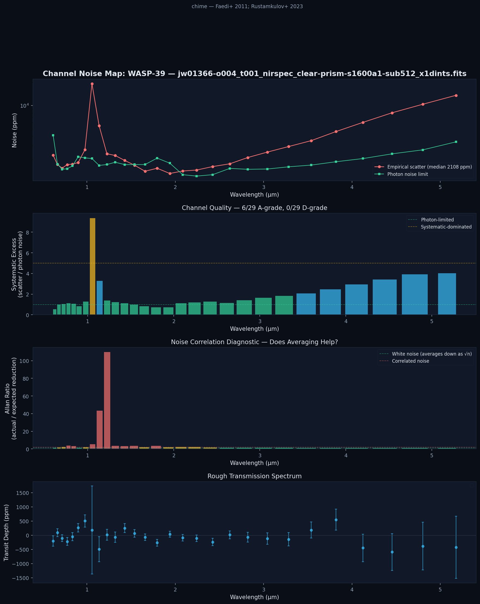
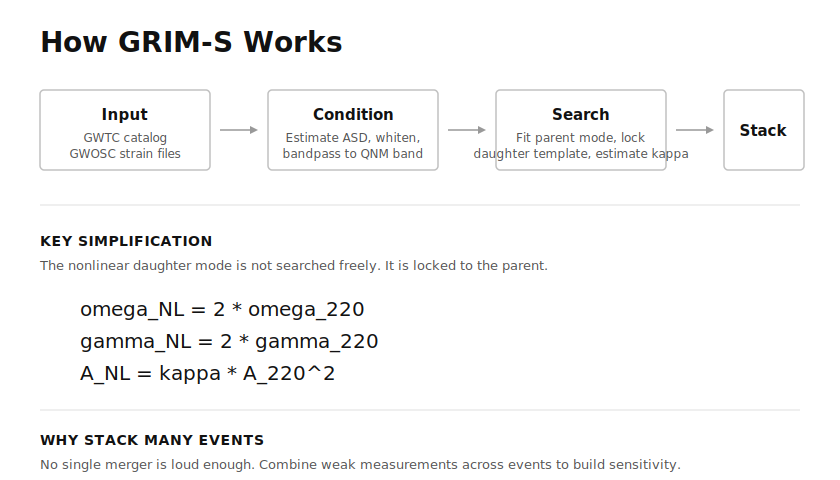

# bown-instruments

**Measure your signal path before you trust your result.**

One package, two instruments, a shared discipline inherited from Ralph Bown (1891-1966), who directed radio research at Bell Telephone Laboratories. Bown understood that every measurement system degrades silently unless you build the diagnostic into the instrument itself.

```bash
pip install -e ".[all]"      # both instruments
bown chime WASP-39           # JWST channel diagnostics
bown grims --events 32       # GW ringdown coupling
bown selftest                # verify both pipelines
```

## The instruments

| | CHIME | GRIM-S |
|---|---|---|
| **Full name** | Channel Health & Instrument Metrology for Exoplanets | Gravitational Intermodulation Spectrometer |
| **Domain** | JWST transit spectroscopy | LIGO/Virgo/KAGRA ringdowns |
| **Measures** | Per-wavelength noise quality (grade A-D) | Nonlinear mode coupling coefficient (kappa) |
| **Bown patent** | US 1,747,221 (1930) -- diversity reception | US 1,573,801 (1926) -- self-testing alarm |
| **Key result** | WASP-39b segment quality varies 4x within one observation | kappa = +0.015 +/- 0.007 (2.2 sigma) across 128 BBH mergers |

### CHIME: Not all JWST segments are created equal

Applied to WASP-39b NIRSpec G395H data (JWST ERS Program 1366), CHIME finds that within a single observation, segment quality varies by **4x**. Segment 1 approaches photon-limited performance (17/18 A-grade bins); segment 2 is systematic-dominated (0/18 A-grade bins, 4.89x photon noise). Blindly concatenating segments without this diagnostic degrades the transmission spectrum.

<p align="center">
  
</p>

**10 targets, 61 observations, 199 segments surveyed.** Median segment quality is 1.97x photon noise.

### GRIM-S: Constraining nonlinear mode coupling in black hole ringdowns

After a binary black hole merger, the remnant rings down through quasinormal modes. At second order, Einstein's field equations produce a quadratic daughter mode whose amplitude is proportional to kappa. GRIM-S estimates kappa by phase-locking the daughter template to the parent mode and stacking across 128 events from GWTC-3.

<p align="center">
  <picture>
    <source media="(prefers-color-scheme: dark)" srcset="results/grims_plots/grims_pipeline_dark.svg">
    
  </picture>
</p>

| Phase | Events | kappa | Significance | What changed |
|---|---|---|---|---|
| 1 | 32 | -0.047 +/- 0.043 | 1.1 sigma | Initial H1-only baseline |
| 2 | 134 | +0.028 +/- 0.019 | 1.5 sigma | Expanded catalog |
| 2.5 | 122 | +0.016 +/- 0.030 | 0.5 sigma | Colored-noise likelihood |
| **3** | **128** | **+0.015 +/- 0.007** | **2.2 sigma** | **Multi-detector + weight-capped stacking** |

## The shared discipline

Both instruments are built on the same engineering principles:

**1. Self-test before science** (US 1,573,801). Inject a known signal through your own pipeline. If you can't recover what you put in, don't trust what comes out. Both instruments run injection-recovery tests before reporting results.

**2. Diversity weighting** (US 1,747,221). Grade your channels independently, weight the combination by measured quality. Don't let one bad channel corrupt the result. CHIME grades wavelength bins A-D; GRIM-S caps per-event weights to prevent single-event dominance.

**3. Measure first, engineer second.** If you can't point to a diagnostic that tells you the instrument is working, you are guessing.

These aren't metaphors. They are codified in `bown_instruments.core` as reusable patterns: `SelfTest`, `diversity_weight`, `check_instrument_health`.

## Package structure

```
src/bown_instruments/
    __init__.py              Version, top-level docstring
    cli.py                   Unified CLI: bown {chime,grims,selftest}
    core/                    Shared Bown measurement patterns
        self_test.py         Injection-recovery protocol (US 1,573,801)
        diversity.py         Quality-weighted combination (US 1,747,221)
        diagnostics.py       Instrument health checks
    chime/                   JWST channel diagnostics
        channel_map.py       Per-wavelength noise grading (A/B/C/D)
        diversity.py         Quality-weighted spectral combination
        ephemeris.py         Transit ephemerides for 27 targets
        extract.py           FITS data extraction and alignment
        mast.py              MAST archive search and download
        transit_fit.py       Mandel-Agol transit model + GP systematics
        plot.py              Diagnostic visualizations
        cli.py               CHIME-specific CLI logic
    grims/                   Gravitational ringdown coupling
        qnm_modes.py         Kerr QNM frequency catalog
        ringdown_templates.py Waveform generation (kappa-parameterized)
        gwtc_pipeline.py     GWTC-3 catalog and GWOSC data loading
        whiten.py            ASD estimation, whitening, bandpass
        phase_locked_search.py Phase-locked matched filter
        bayesian_analysis.py Posterior estimation and stacking
        jackknife.py         Leave-one-out stability test
        self_test.py         Injection-recovery validation
        mass_analysis.py     Full-catalog pipeline orchestrator
        + 8 more modules (Fisher, sampling, colored likelihood, ...)

tests/                       69 tests (50 CHIME + 19 GRIM-S)
scripts/                     Analysis runners and data management
results/                     Committed analysis outputs
data/                        GW150914 reference strain (1 MB)
patents/                     13 of Ralph Bown's original patent PDFs
```

## Installation

```bash
pip install -e ".[all]"       # Everything
pip install -e ".[chime]"     # CHIME only (adds astropy, astroquery)
pip install -e ".[grims]"     # GRIM-S only (adds h5py, qnm)
pip install -e ".[dev]"       # All + pytest + ruff
```

## Data

- **CHIME**: Analysis results committed. Raw FITS files fetched on-demand from MAST. See [DATA.md](DATA.md).
- **GRIM-S**: GW150914 reference strain committed. Full dataset (~8.5 GB) from [GWOSC](https://gwosc.org). Scripts in `scripts/grims/`.

## Tests

```bash
python -m pytest tests/ -q    # 69 tests
```

## Author

Hunter Bown (hunter@shannonlabs.dev)

Great-grandson of Ralph Bown. The transistor enabled the circuits. The circuits enabled the medicine. The medicine enabled me. Now I'm finishing what he started: instruments that measure their own signal path.

## License

MIT
